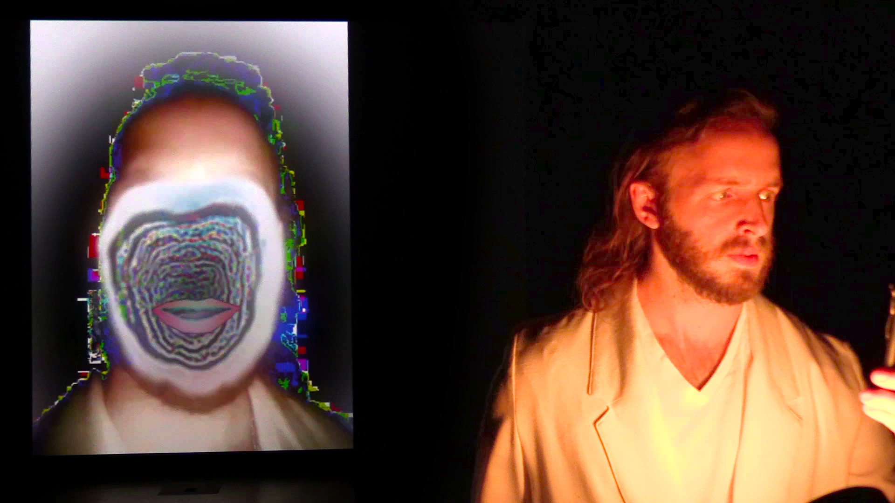

# Red Dot oF app

An application for real-time face feature tracking, mask creation, and glitch effects as used in the 2019 performance _Red Dot_.

Tasks performed:
- **Face landmark detection:** the 68-point face landmark detector from the dlib toolkit is used to obtain a set of face landmarks from a real-time video stream. 
- **Mask and mesh creation:** The landmark points are used to create several meshes to be overlaid on the video, including a full-face mask for feedback effects, and a mouth mesh built from the lip vertices.
- **Audio-reactive animation:** An OSC stream of a voiceover track's amplitude is used to displace the central vertices of the mouth mesh, creating an animated lip sync in the video even when the live performer's mouth is closed.
- **Glitch effects:** The most recent frames from the input video stream are stored in a queue and looped through whenever no new frames are detected. This creates stuttering glitch effects, and also eliminates any freezes that would occur from dropped frames.

## Dependencies

- dlib toolkit for face tracking.
- ofxSpout for streaming mask textures to Max/MSP for further processing.